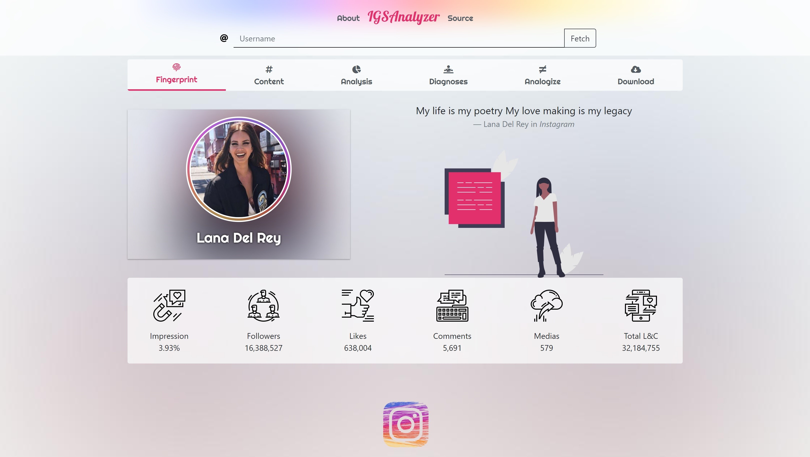

# IG-SAnalyzer 

**IG-SAnalyzer** is a simple analysis tool for Instagram pages. It Extracts data from an Instagram page and shows features like comment, likes, view, ... counts and calculate some parameters like engagement and draw some history charts for example for likes or engagement or comments. it also draws Impression clock and calendar.

  <b>it's a progressive web app (PWA) and written in ReactJs.</b>

  

